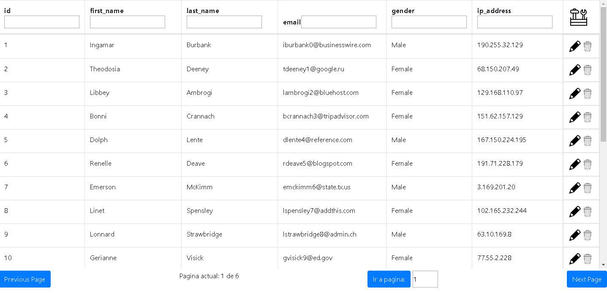

# Componentes

Libreria de componentes HTML construidos 100% usando JQuery.Incluye los siguientes componentes:
* Table
Componente que genera una tabla HTML a partir de un array o el resultado de un webservice. Incluye soporte para: habilitar y deshabilitar operaciones CRUD dentro de la tabla, configurables a traves de eventos (create, delete, edit, update); habilitar y deshabilitar ordenamiento y filtrados de datos (por igualdad); realizar paginación (debe ser soportado por el webservice).

### Servidor de Pruebas

El repositorio incluye un servidor sencillo de Express.js que implementa un webservice para la demostración de la tabla. Se ejecuta con los siguientes comandos luego de descargar el repositorio:
* cd testing-server
* npm install (solo la primera vez) 
* npm start

# Manual de uso de los componentes

## Table
Componente que genera una tabla HTML a partir de un array o el resultado de un webservice. Incluye soporte para: habilitar y deshabilitar operaciones CRUD dentro de la tabla, configurables a traves de eventos (create, delete, edit, update); habilitar y deshabilitar ordenamiento y filtrados de datos (por igualdad); realizar paginación (debe ser soportado por el webservice).

#### Notas
* WebService como fuente:
* Filtrados: El filtrado se ejecuta al desenfocar el input correspondiente. Cuando no se tiene paginación, los filtrados se acumulan. Con paginación, se filtra usando el último campo seleccionado.
* Paginación:

#### Constructor 
new table(divContainer, content, configParam={}, styles={}, events={}, rowEvents={})

* divContainer: strnig. Id (sin #) del elemento donde se insertara la tabla.
* content: string|arreglo. URL del webservice de donde se obtendran los datos de la tabla con formato http:// o https:// | Arreglo del contenido.
    * El contenido debe ser un arreglo de diccionarios/objetos Json. Ej: {llave1: valor1, llave2: valor2, ...} 
* configParam: JSON Object. Diccionario con las configuraciones de la tabla. Default: {}
    *  page: false|int. Número de la pagina a mostrar si el webservice acepta paginacion. Si es false, el webservice retorna todo el contenido o  Default: false. 
    *  pageSize: int. Indica la cantidad máxima de registros de una página, si se habilita la paginación. Default: 20.
    *  deletable: bool. Indica si los elementos de la tabla son eliminables. Default: false.
    *  editable: bool. Indice si los elementos de la table son modificables. Default: false.
    *  sortable: false | "all" | array. Indica por que campos se puede ordenar la tabla. Si es false, ningun campo es ordenable. Si es "all" todos los campos son ordenables. Si es un array, los campos dentro del array son los ordenables. Default: false.
    *  filterable: false | "all" | array. Indica por que campos se puede ordenar la tabla. Si es false, ningun campo es ordenable. Si es "all" todos los campos son ordenables. Si es un array, los campos dentro del array son los ordenables. Default: false.
* styles: Json Object. Diccionario con estilos aplicables a la tabla. Las propiedades se escriben usando camel case. Ej: {backgroundColor: "white"}. Default: {}.
* events: Json Object. Diccionario con los eventos aplicables a la tabla. Acepta los siguientes eventos: load, click, dblclick. Ej: {load: function(){alert("Cargando")}}, Default: {}
* rowEvents: Json Object. Diccionario con los eventos aplicables a cada fila de la tabla. Acepta los siguienes eventos: load, click, dblclick, delete, edit, update, create. Ej: Ej: {edit: function(){alert("Editando")}}- Default: {}

#### Atributos
Elemenos accesibles usando this.[atributo], siendo this el objeto table.

* $element: Elemento Jquery con el contenedor de la tabla.
* source: Fuente de los datos de la tabla. Puede ser un URL o un arreglo.
* filteringFields: Json usado para realizar filtros de la table cuando no se tiene paginacion. Las llaves corresponden a los campos filtrables y el valor indice que valor por el cual se realiza la comparacion de igualdad. 
* sortingFields: Json usado para ordenar la tabla cuando no se tiene paginacion.
* tableFiltered: Arreglo usado cuando no se tiene paginacion, usado para los datos fultrados de la tabla filtrada y mostrarlos sin perder la tabla original.
* page: Número entero que indica la pagina de datos mostrada actualmente.
* pageCount: Número entero que indica la cantidad de paginas que contiene los datos actuales.
* tableContent: Contenido de los datos mostrados actualmente.
* URLsort: Json usado para realizar ordenamiento cuando el src es un webservice
* URLfilter: Json usado para realizar filtrado cuando el src es un webservice
* columns: Arreglo usado para dibujar el header de la tabla
* config: Json con las configuraciones de la tabla

#### Métodos
* drawContent: Método usado para renderizar el contenido de la tabla.
* getContentFromURL: Método usado para obtener el contenido de la tabla de un webservice
* filterContent: Método usado para filtrar el contenido de la tabla
* sortContent: Método usado para ordenar el contenido de la tabla